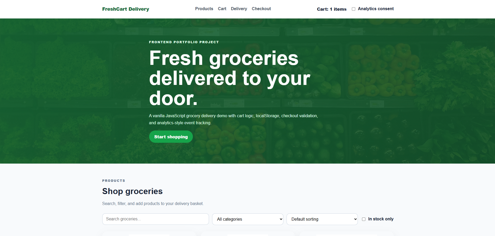
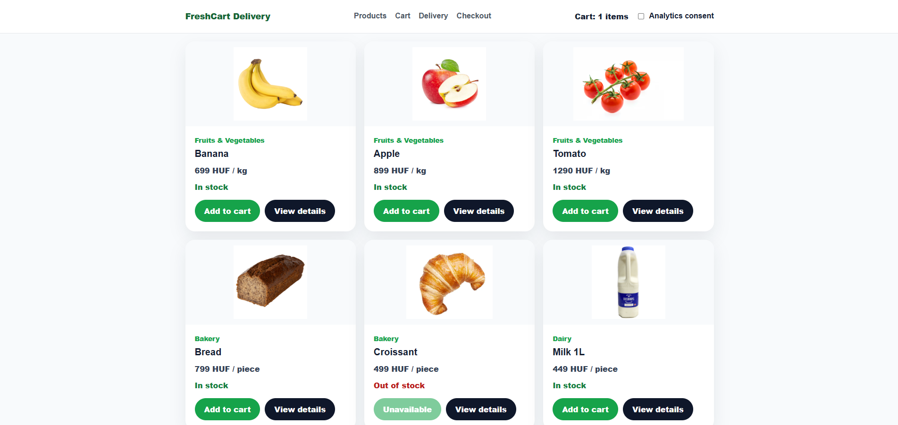
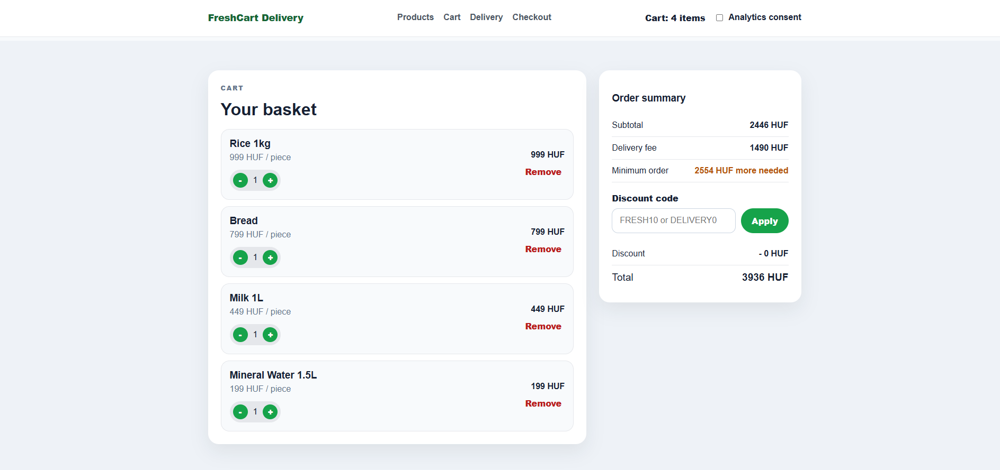
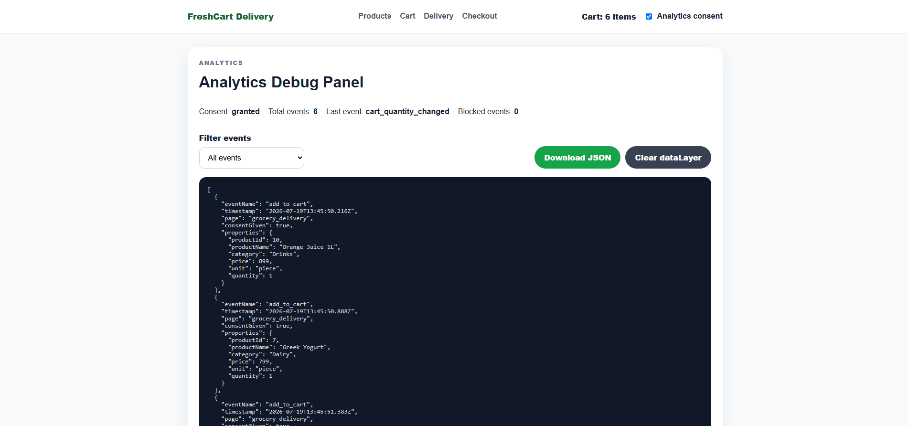
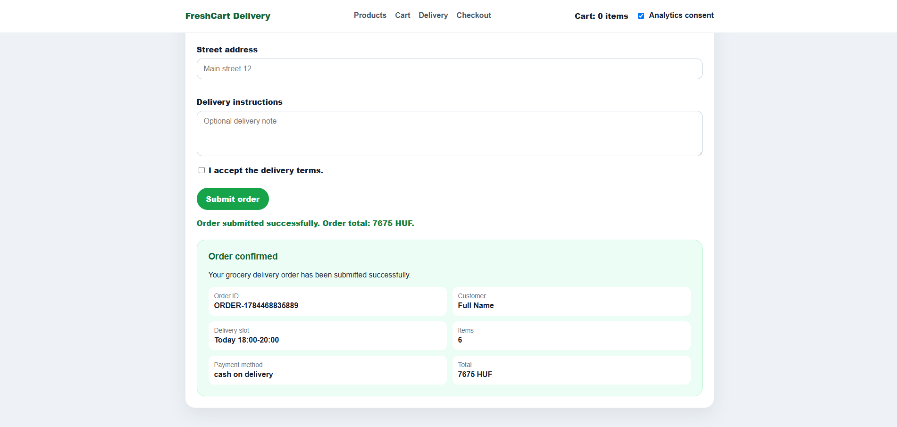

# Grocery Delivery Analytics Demo

A responsive grocery delivery webshop built with HTML, CSS and vanilla JavaScript.

The project includes dynamic product rendering, search and filtering, cart management, delivery slot selection, checkout validation, localStorage persistence, and analytics-style event tracking with consent-based dataLayer logic.

This project was built as part of my junior frontend developer portfolio.

## Live Demo

https://sentkirali.github.io/grocery-delivery-analytics-demo/

## Features

- Grocery product listing
- Product search
- Category filtering
- Price sorting
- In-stock filtering
- Add to cart functionality
- Cart quantity controls
- Remove item from cart
- Subtotal, delivery fee and total calculation
- Cart persistence with localStorage
- Delivery slot selection
- Checkout form validation
- Fake order submission flow
- Analytics-style event tracking
- Custom dataLayer
- Consent-based tracking control
- Analytics debug panel

## Key Concepts Practiced

- HTML5
- CSS3
- JavaScript
- DOM manipulation
- Event listeners
- Product rendering
- Cart logic
- Form validation
- localStorage
- JavaScript modules
- Data layer logic
- Analytics events
- Consent logic
- Payload validation
- Browser DevTools
- Git and GitHub workflow

## Analytics Events

The project tracks the following events:

- product_list_viewed
- product_searched
- category_filtered
- sort_changed
- stock_filter_changed
- add_to_cart
- remove_from_cart
- cart_quantity_changed
- delivery_slot_selected
- order_submitted

If analytics consent is disabled, the webshop still works, but tracking events are blocked and not pushed to the dataLayer.

## Features

- Product listing rendered from JavaScript data
- Product search, category filtering and sorting
- Product detail modal
- Shopping cart with quantity controls
- Cart persistence with localStorage
- Delivery slot selection
- Coupon code logic
- Minimum order value validation
- Dynamic delivery fee rules
- Checkout form validation with field-level errors
- Order confirmation summary
- Analytics dataLayer simulation
- Consent-based tracking logic
- Blocked tracking counter
- Analytics event filtering
- dataLayer JSON export
- Analytics consent persistence with localStorage

## Analytics and consent logic

This project includes a simulated analytics `dataLayer` to demonstrate how frontend user interactions can be tracked and debugged.

Tracked events include:

- `product_list_viewed`
- `product_detail_viewed`
- `product_searched`
- `category_filtered`
- `sort_changed`
- `stock_filter_changed`
- `add_to_cart`
- `remove_from_cart`
- `cart_quantity_changed`
- `delivery_slot_selected`
- `coupon_applied`
- `coupon_failed`
- `checkout_validation_failed`
- `order_submitted`
- `datalayer_exported`

The analytics panel allows filtering events by category and exporting the current `dataLayer` as a JSON file.

Tracking is controlled by an analytics consent checkbox. If consent is disabled, events are blocked and counted separately instead of being pushed into the `dataLayer`.

## Tech stack

- HTML
- CSS
- JavaScript
- ES Modules
- DOM manipulation
- Event handling
- localStorage
- JSON
- GitHub Pages

## Screenshots

### Home page



### Product detail modal



### Cart and checkout



### Analytics debug panel



### Order confirmation



## Project structure

```text
grocery-delivery-analytics-demo/
├── index.html
├── README.md
├── images/
├── screenshots/
└── src/
    ├── app.js
    ├── analytics.js
    ├── cart.js
    ├── checkoutValidation.js
    ├── products.js
    ├── storage.js
    └── style.css
```
